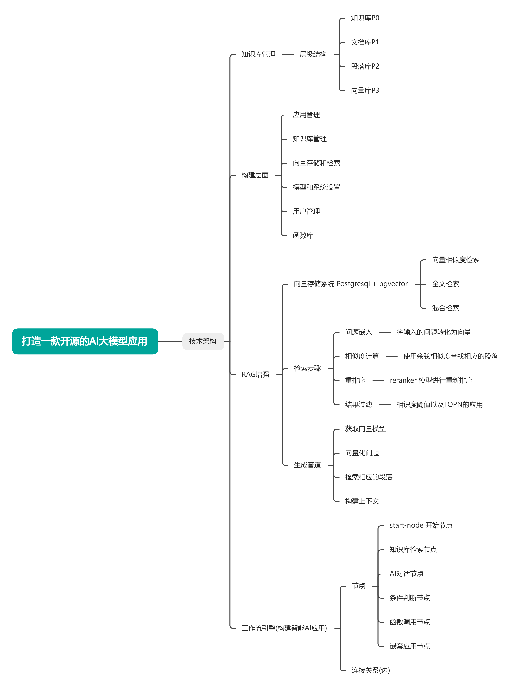

# ManxiAI - 企业级AI知识库系统

ManxiAI是一个基于Django和RAG技术的企业级AI知识库系统，复刻自MaxKB的核心功能。

## 🏗️ 项目架构

```
ManxiAI/
├── config/                 # 项目配置
│   ├── __init__.py
│   ├── settings.py         # Django设置
│   ├── urls.py             # URL配置
│   ├── wsgi.py             # WSGI配置
│   └── celery.py           # Celery配置
├── apps/                   # 应用模块
│   ├── core/               # 核心工具模块
│   ├── users/              # 用户管理
│   ├── knowledge_base/     # 知识库管理
│   ├── document/           # 文档管理
│   ├── chat/               # 对话管理
│   ├── embedding/          # 向量化处理
│   ├── pipeline/           # RAG管道
│   ├── workflow/           # 工作流编排
│   └── model_management/   # 模型管理
├── requirements.txt        # 依赖包
├── manage.py              # Django管理工具
└── start.py               # 启动脚本
```

## 🗂️ 功能模块



系统主要功能模块划分：

1. **用户管理**  
   - 用户注册/登录/权限控制
   - 团队管理
   - API密钥管理

2. **知识库管理**  
   - 知识库CRUD
   - 文档分类/标签
   - 访问权限控制

3. **文档处理**  
   - 多格式文档上传
   - 文档解析/分块
   - 元数据提取

4. **向量化处理**  
   - 文本向量化
   - 向量存储
   - 相似度检索

5. **对话管理**  
   - 对话历史
   - 上下文管理
   - 多轮对话

6. **RAG管道**  
   - 检索增强生成
   - 结果优化
   - 缓存机制

7. **模型管理**  
   - 大模型接入
   - 模型微调
   - 推理服务


## 🚀 快速开始

### 1. 环境准备

```bash
# 创建虚拟环境
python -m venv venv
source venv/bin/activate  # Linux/Mac
# or
venv\Scripts\activate     # Windows

# 安装依赖
pip install -r requirements.txt
```

### 2. 数据库配置

```bash
# 安装PostgreSQL和pgvector扩展
# Ubuntu/Debian
sudo apt-get install postgresql postgresql-contrib
sudo apt-get install postgresql-14-pgvector

# 创建数据库
sudo -u postgres createdb manxiai

# 启用pgvector扩展
sudo -u postgres psql -d manxiai -c "CREATE EXTENSION vector;"
```

### 3. 环境变量配置

创建`.env`文件：

```env
# Django配置
SECRET_KEY=your-secret-key-here
DEBUG=True
ALLOWED_HOSTS=localhost,127.0.0.1

# 数据库配置
DB_NAME=manxiai
DB_USER=postgres
DB_PASSWORD=postgres
DB_HOST=localhost
DB_PORT=5432

# OpenAI配置
OPENAI_API_KEY=your-openai-api-key
OPENAI_BASE_URL=https://api.openai.com/v1

# 向量化配置
EMBEDDING_MODEL=text-embedding-ada-002
EMBEDDING_DIMENSIONS=1536
```

### 4. 初始化项目

```bash
# 数据库迁移
python start.py migrate

# 创建超级用户
python start.py createsuperuser

# 启动开发服务器
python start.py runserver
```

### 5. 启动服务

```bash
# 启动Django服务器
python start.py runserver 8000

# 启动Celery worker（新终端）
python start.py celery
```

## 📚 API文档

项目启动后，可以通过以下地址访问API文档：

- Swagger UI: http://localhost:8000/swagger/
- ReDoc: http://localhost:8000/redoc/

## 🔧 主要功能 + 任务排期

### 第一阶段：核心RAG功能 (2-3周)
- [x] 用户管理系统
- [x] 知识库管理
- [ ] 文档上传与处理， 文档管理模块 - 文档上传、解析、分块处理
- [ ] 向量化处理模块 - 文本向量化、相似度搜索
- [ ] 对话管理模块 - 聊天会话、消息历史
- [ ] RAG管道模块 - 检索增强生成流程

### 第二阶段：增强功能
- [ ] 文档解析（PDF、Word、PPT等）  OCR、表格提取、多语言
- [ ] 智能分块与索引
- [ ] 多模态检索 混合检索、重排序算法
- [ ] 异步任务处理 文档处理、向量化任务

### 第三阶段：高级特性
- [ ] 工作流编排  可视化设计、条件分支
- [ ] 模型管理 多模型支持、性能监控
- [ ] 权限控制
- [ ] 监控与日志

## 📖 模块说明

### 核心模块 (apps/core)
- 提供基础模型类
- 通用工具函数
- 状态管理

### 用户管理 (apps/users)
- 用户注册、登录、认证
- 团队管理
- API密钥管理

### 知识库管理 (apps/knowledge_base)
- 知识库CRUD
- 分享与权限
- 标签管理
- 配置管理

### 文档管理 (apps/document)
- 文档上传
- 格式解析
- 内容提取
- 版本控制

### 对话管理 (apps/chat)
- 对话会话
- 消息历史
- 反馈评价

### 向量化处理 (apps/embedding)
- 文本向量化
- 向量存储
- 相似度计算

### RAG管道 (apps/pipeline)
- 检索增强生成
- 多阶段处理
- 结果排序

## 🔍 技术栈

- **后端框架**: Django 4.2 + DRF
- **数据库**: PostgreSQL + pgvector
- **任务队列**: Celery + Redis
- **AI框架**: LangChain
- **向量化**: OpenAI Embeddings / Sentence Transformers
- **文档处理**: PyPDF2, python-docx, openpyxl
- **部署**: Docker + Gunicorn

## 🤝 贡献指南

1. Fork 本仓库
2. 创建功能分支 (`git checkout -b feature/AmazingFeature`)
3. 提交更改 (`git commit -m 'Add some AmazingFeature'`)
4. 推送到分支 (`git push origin feature/AmazingFeature`)
5. 打开 Pull Request

## 📄 许可证

本项目采用 MIT 许可证 - 查看 [LICENSE](LICENSE) 文件了解详情。

## 🙏 致谢

感谢 MaxKB 项目提供的架构参考和设计思路。